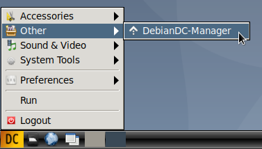
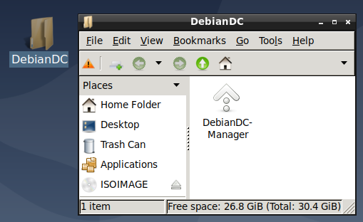
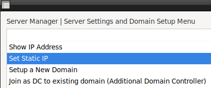
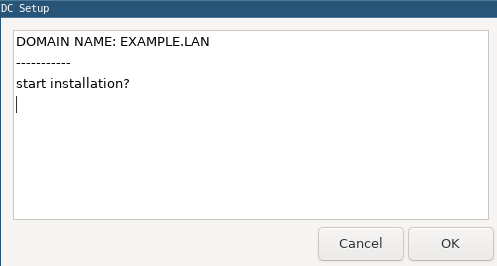

## DebianDC User Guide

The document contains detailed information about the use for the DebianDC Active Directory Domain Environment GUI.

- [1. Installation](#1-installation)
  - 1.1 Installing DebianDC on the ready Debian installation
  - 1.2 Installing DebianDC with DebianDC-buster-installer.iso
- [2. DebianDC-Manager](#2-debiandc-manager)
  - 2.1 DebianDC-Manager Screen
    - 2.1.1 Static ip Assignment
    - 2.1.2 Setting up the Active Directory role
---

### 1. Installation

You can use the DebianDC application in two ways.
#### 1.1- Installing DebianDC on the ready Debian installation
This setup; It is made from the DebianDC repository to the existing Debian installed machine.

As the `root`: <ins>Unless otherwise stated, perform operations as root user.!!</ins>

```bash
# wget https://raw.githubusercontent.com/eesmer/DebianDC/master/debiandc-installer.sh
# bash debiandc-installer.sh
```
**If a desktop environment is not installed in the system, the DebianDC installation installs the lxde-core desktop environment.**

#### 1.2- Installing DebianDC with DebianDC-buster-installer.iso
This installation is done automatically from the installer.iso file.
Auto install creates shortcuts for lxde-core desktop and DebianDC-Manager application on Debian distribution.
To install, it is sufficient to attach the installer.iso file to the machine.
The setup itself will do the rest.

Either way, after the installation is complete
By logging in from the login screen (with the root password specified during the installation)
or

```bash
ssh -X -p40022 root@DEBIANDC_IP_ADDRESS
run the 'manager' command
manager
```
can be used in the form.

download link will be added

### 2. DebianDC-Manager
After the installation is complete
You can log in with the root user you specified during the installation.


You can access the Manager application from the opened DebianDC desktop environment.



#### 2.1- DebianDC-Manager Screen
After the DebianDC desktop installation, the Active Directory role must be installed.
When you open the Manager application, a menu will open with setup and configuration options if Active Directory Role is not installed.


`Important Notice`: <ins> You must give a fixed IP to the DC machine. </ins>

##### 2.1.1- Static ip assignment
The IP address of the DC machine must be fixed.
Otherwise, the changed ip address later may cause the Active Directory role to not work.




DebianDC will prompt you to reboot for ip definition to take effect.

##### 2.1.2- Setting up the Active Directory role
Active Directory Role can be installed after fixed ip definition.
The installation of this role is done with the "Setup a New Domain" option from the same menu.

The process of installing the AD role;
It asks for the new name of the machine, the domain name to be installed, and the password of the Administrator user, respectively.


After getting the information required to install the role, a screen will appear asking for confirmation for installation.
After the confirmation of this screen, the Active Directory role installation begins.




When the installation is complete, DebianDC will ask for a reboot.
After DebianDC restarts, you can log in with the root user and use the manager application.
